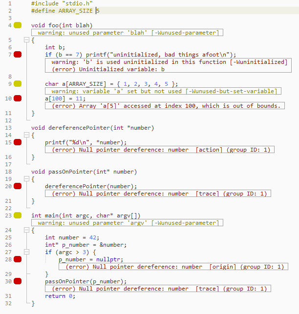

# ZBS-GCC-CPPCheck

## C-family issue annotation via GCC and CPPCheck

------------------------------

Lua can be tightly coupled with C - and by extension, C++ - so swapping back and forth between editing Lua and C-family files is not unusual. This plugin/package adds C-family code checking to Zerobrane Studio, which saves swapping editors/IDEs or finding warnings and errors at the build stage.

It runs whenever you save a C-family source file, running your file through the relevant GCC compiler (`gcc` or `g++`) as well as performing sophisticated static analysis with [CPPCheck](http://cppcheck.sourceforge.net/), 
to catch issues that the compiler doesn't find by itself.

--------------------------------

## Example: 



Annotations with prefixes contained in parentheses, eg `(error)`, come from CPPCheck. Others come from gcc/g++. Notice that the `Null pointer dereference` CPPCheck reported error has an ID added to the end, since it is tracing a single pointer and if multiple similar issues occur, this makes it easy
to differentiate between the traces.

## Installation

Clone or download and put the `.lua`  file into the `packages` subdirectory of your Zerobrane Studio installation directory.

You must have GCC and CPPCheck available on your command line.

#### Windows

Install [MinGW](http://mingw.org/). After installing, run the `MinGW Installation Manager`, scroll down the Packages and check `mingw32-gcc` and `mingw32-gcc-g++` to stage them for installation. Then go to the `Installation` menu and `Apply changes`.
 
Go to the [CPPCheck website](http://cppcheck.sourceforge.net/) then download and run the installer. Add the location of the installation to your `PATH`.

#### Linux

Run:

```bash
sudo apt-get update
sudo apt-get install build-essential
sudo apt-get install cppcheck
```


